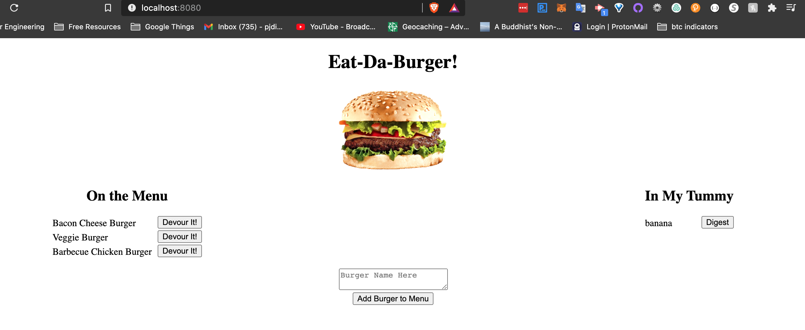

# Philip-DiPaula-OSU-bootcamp-hwk13

## These are the files for the homework assignment associated with section 13 of the OSU Web Development Bootcamp

* Here is a link to the [github](https://github.com/pjdip/Philip-DiPaula-OSU-bootcamp-hwk13-burger)
* Here is a link to the deployed application on [heroku]()

The goal of this assignment was to build an MVC application that can be used to create, read, update, and delete (CRUD) burgers in a [mysql](https://www.mysql.com/downloads/) database using the [Express](https://www.npmjs.com/package/express) and [Express Handlebars](https://www.npmjs.com/package/express-handlebars) packages to construct the user interface in [node.js](https://nodejs.org/en/download/). Burger data is stored in and retrieved from a MySQL database using the [mysql package](https://www.npmjs.com/package/mysql) and the SQL query language.

* [Installation](#installation)
* [Usage](#usage)
* [Credits](#credits)
* [Badges](#badges)
* [License](#license)

## Installation

Installation requirements include node.js, MySQL, and the express/express-handlebars/mysql npm packages.
You will find package dependency .json files in the github repo that should allow the npm packages to work without any further effort on your end. You will need to install node and mysql on your own. Installation options for node can be found [here](https://nodejs.org/en/download/). Installation options for MySQL can be found [here](https://www.mysql.com/downloads/)

## Usage 

In order to use this application, first clone the repo to your local machine. Then use the command line to navigate to the main folder containing server.js. Once you have MySQL installed, navigate to the 'db' folder in the main folder of the repository. Using the command "mysql -u username -ppassword" substitute in your username and password and press enter. Once you have entered mysql CLI, use the command source schema.sql to create the burgers_db and burgers table within that database. You may optionally run the command "source seeds.sql" to populate the table with some initial data". Once you have node installed, you should be able to start the server using the command 'node server.js'. If you are successful, there will be a console.log statement alerting you that the app is listening on port 8080. If you have any troubles running the application, try doing 'npm install' from the main folder and then try again.

Once you have the server running, if you go to your browser and head to the address "http://localhost:8080/" you should be presented with the home page of the app. From here you've got some options. On the left you will see some burgers that are "On The Menu." If you click the "Devour It!" button, they will be relocated to "In My Tummy." Burgers that are in your tummy can be digested with the "Digest" button. If you digest a burger, it will be removed from your tummy. If you want to add a burger to the menu, simply type in the textarea the name of the burger you wish to add, then click the "Add Burger to Menu" button.

Here are some screenshots:

Main Page: 

## Credits

Special Thanks to express documentation:
* [npm](https://www.npmjs.com/package/express)
* [docs](https://expressjs.com/en/guide/routing.html)

Special Thanks to express-handlebars documentation:
* [npm](https://www.npmjs.com/package/express-handlebars)

Special Thanks to mysql package documentation:
* [npm](https://www.npmjs.com/package/mysql)

Special Thanks to MySQL documentation:
* [docs](https://dev.mysql.com/doc/)

Thanks to MDN for [list styling tips](https://developer.mozilla.org/en-US/docs/Learn/CSS/Styling_text/Styling_lists)

Thanks to [stackoverflow](https://stackoverflow.com/questions/49449325/this-is-selecting-window-object-instead-of-clicked-element-jquery) for help with a little bug I was having

Special Thanks to [ChilledCow](https://www.youtube.com/channel/UCSJ4gkVC6NrvII8umztf0Ow) for providing chill lofi beats to code to

## Badges

## License

Licensed under the [GNU General Public License v3.0](https://choosealicense.com/licenses/gpl-3.0/)

---